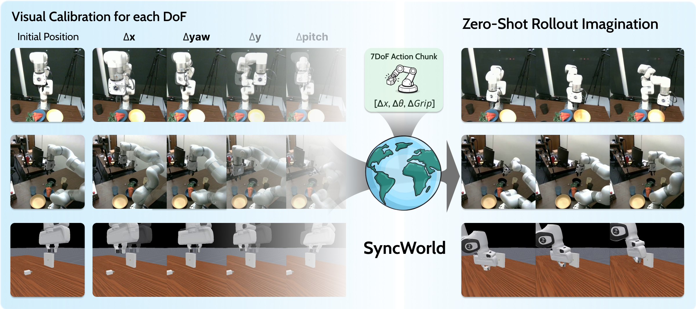

<div align="center">

# SyncWorld: Visual Calibration Enables World Models as Zero-Shot Simulators

[Yuncong Yang](https://yyuncong.github.io/),
[Zhengtao Han](https://www.hanzht.com/),
[Furkan Özyurt](https://www.linkedin.com/in/ozyurtf/),
[Zeyuan Yang](https://miicheyang.github.io/),
[Han Yang](https://hanyangclarence.github.io/),
[Junyi Cao](https://xjay18.github.io/),
[Haoyu Zhen](https://haoyuzhen.com/),
[Yilun Du](https://yilundu.github.io/),
[Chuang Gan](https://people.csail.mit.edu/ganchuang/)

[](https://arxiv.org/abs/2609.09155)
[](https://umass-embodied-agi.github.io/SyncWorld/)
[](https://huggingface.co/yyuncong/SyncWorld)

</div>

<p align="center">
  
</p>

## Introduction

**Actions are not a universal language in pixel space.** Change the camera, the robot placement or
the embodiment, and the same numerical action produces a different visual effect — which is why
action-conditioned world models trained on mixed data generalize badly to a new setup.

**SyncWorld brings in-context learning to this problem.** Instead of fine-tuning per deployment, it
reads a short [**visual calibration**](./docs/visual_calibration.md) episode — paired frames and
actions exercising every controllable degree of freedom — as a *prompt* that demonstrates the
setup-specific Action–Visual Mapping. The mapping is inferred at inference time from that
demonstration rather than baked into the weights, so a single checkpoint acts as a **zero-shot
simulator** in unseen environments with no additional training. Training with calibration contexts
also teaches the model to fall back on interaction history when no calibration is available.

This repository contains the full training and evaluation code:

- **[Evaluation](#evaluation)** — full-episode autoregressive rollout scored with PSNR / SSIM /
  LPIPS, data-parallel over episodes. Entry point: `examples/eval_gripperhead_fdm_rollout.py`.
- **[Training](#training)** — distributed FSDP trainer, typed TOML recipes, native DCP checkpoints
  with HuggingFace `safetensors` import/export. Entry point: `cosmos_framework.scripts.train`.

## News

- **[2026-09]** Training and evaluation code released.
- **[2026-09]** Model weights ([`yyuncong/SyncWorld`](https://huggingface.co/yyuncong/SyncWorld))
  and evaluation sets
  ([`yyuncong/SyncWorld-Evaluation`](https://huggingface.co/datasets/yyuncong/SyncWorld-Evaluation))
  released on HuggingFace.
- **[2026-09]** Paper released on [arXiv](https://arxiv.org/abs/2609.09155).

> **Provenance.** SyncWorld is derived from
> [NVIDIA Cosmos-Framework](https://github.com/NVIDIA/Cosmos) and is distributed under the same
> [OpenMDW-1.1](./LICENSE) license. NVIDIA's copyright notices, [`NOTICE`](./NOTICE) and
> [`ATTRIBUTIONS.md`](./ATTRIBUTIONS.md) are retained as that license requires. The Python package
> is still imported as `cosmos_framework`, and models are trained from the public **Cosmos3-Nano**
> checkpoint — both names refer to upstream artifacts and are kept so the code and the docs match.

## Documentation

- [Installation](#installation)
  - [Setup reference](./docs/setup.md)
- [Evaluation](#evaluation)
- [Training](#training)
  - [Training reference](./docs/training.md) · [JSONL Dataset](./docs/dataset_jsonl.md)
- Reference
  - [Differences from the paper](./docs/paper_differences.md)
  - [Visual Calibration](./docs/visual_calibration.md)
  - [SFT Config Schema](./docs/sft_config.md)
  - [Code Structure](./docs/code_structure.md)
  - [Environment Variables](./docs/environment_variables.md)
  - [FAQ](./docs/faq.md)

## Installation

**Requirements:** Linux x86-64 (or aarch64), glibc ≥ 2.35, an NVIDIA GPU of Ampere generation or
newer with a driver for CUDA ≥ 12.8, and ~60 GB of free disk for the environment. See
[System Requirements](./docs/setup.md#system-requirements) for the full list.

The environment is built in two layers, and **both are pinned**:

| layer | provides                                                                                       | pinned by                                              |
| ----- | ---------------------------------------------------------------------------------------------- | ------------------------------------------------------ |
| conda | the Python interpreter                                                                         | [`environment.yml`](./environment.yml) (exact version) |
| uv    | ~400 Python packages: PyTorch + CUDA, flash-attn, NATTEN, Transformer Engine, Megatron-Core, … | [`uv.lock`](./uv.lock) (exact versions + git commits)  |

conda handles only the interpreter because everything else is published as wheels on PyPI,
`download.pytorch.org` and NVIDIA's package index — none of it exists on conda channels. `uv sync
--frozen` resolves nothing at install time; it replays the committed lockfile, so two machines get
byte-identical package sets.

### 1. System dependencies

```shell
sudo apt-get install -y --no-install-recommends curl ffmpeg git-lfs tree wget
```

### 2. Clone

```shell
git clone <repository-url> && cd SyncWorld
```

### 3. Create the conda environment

```shell
conda env create -f environment.yml
conda activate syncworld
```

### 4. Install the Python packages

Install `uv` with the standalone installer, which keeps it outside the environment (`uv` is itself
a pinned project dependency, so a copy installed *into* the environment gets downgraded by the sync):

```shell
curl -LsSf https://astral.sh/uv/install.sh | sh
source $HOME/.local/bin/env
```

`UV_PROJECT_ENVIRONMENT` points uv at the conda prefix instead of creating its own `.venv`:

```shell
# CUDA 13.0 (recommended). For CUDA 12.8, use --group=cu128-train.
UV_PROJECT_ENVIRONMENT="$CONDA_PREFIX" uv sync --frozen --extra train --group=cu130-train
```

This installs the training and evaluation stack plus the `cosmos_framework` package itself
(editable). Verify:

```shell
python -c "import torch, cosmos_framework; print(torch.__version__, torch.cuda.is_available())"
# 2.10.0+cu130 True
```

### Alternatives

A plain `uv venv` and custom torch/CUDA builds are documented in
[Setup](./docs/setup.md#installation). If you already run inside the
[NVIDIA NGC PyTorch container](./docs/setup.md#recommended-base-image), skip conda and run step 4
against the container's own Python.

## Evaluation

[`examples/eval_gripperhead_fdm_rollout.py`](./examples/eval_gripperhead_fdm_rollout.py) rolls each
episode out end-to-end, 16 predicted frames at a time, and scores it against ground truth with
PSNR / SSIM / LPIPS. Its defaults are the shipped recipe, so a released checkpoint needs no tuning
flags.

### 1. Prepare the checkpoint

```shell
hf download yyuncong/SyncWorld --local-dir ./SyncWorld-ckpt
```

The release is self-contained — it ships `config.json`, so it is read directly with no conversion.

The Wan2.2 VAE is not redistributed with it and has to be fetched separately (~2.8 GB, Apache-2.0):

```shell
hf download Wan-AI/Wan2.2-TI2V-5B --include Wan2.2_VAE.pth --local-dir ./wan22-vae
export WAN_VAE_PATH=$PWD/wan22-vae/Wan2.2_VAE.pth
```

### 2. Prepare the evaluation set

[`yyuncong/SyncWorld-Evaluation`](https://huggingface.co/datasets/yyuncong/SyncWorld-Evaluation)
ships the two simulated sets the model was evaluated on (~100 MB):

```shell
hf download yyuncong/SyncWorld-Evaluation --repo-type dataset --local-dir ./SyncWorld-Evaluation
```

| set                    | source    | episodes | leaves | view to pass                               |
| ---------------------- | --------- | -------: | -----: | ------------------------------------------ |
| `evaluation_maniskill` | ManiSkill |       50 |     50 | `render_camera_rgb` (or `base_camera_rgb`) |
| `evaluation_libero`    | LIBERO    |       50 |     50 | `side_rgb` (or `agentview_rgb`)            |

For your own data, `--eval-set` is searched recursively for **episode leaves** — any directory
holding `<view>/video.mp4` plus `pose.pkl`, with a sibling `calibration/` sweep that is never
scored itself:

```
eval_set/
└── PushCube-v1/                          # task
    └── episode_0/
        └── camera_poses_0/
            ├── expert/                   # <- the episode leaf
            │   ├── render_camera_rgb/video.mp4
            │   └── pose.pkl
            └── calibration/
                ├── render_camera_rgb/video.mp4
                └── pose.pkl
```

### 3. Run it

```shell
PYTHONPATH=. torchrun --nproc_per_node=1 examples/eval_gripperhead_fdm_rollout.py \
    --checkpoint ./SyncWorld-ckpt \
    --eval-set ./SyncWorld-Evaluation/evaluation_maniskill \
    --camera-views render_camera_rgb \
    --tag maniskill
```

Swap `--eval-set` and `--camera-views` per the table above for the other two sets. Evaluation is
data-parallel over episodes, so raising `--nproc_per_node` is all multi-GPU needs; results are
written per episode as they complete, so rerunning the same command resumes where it stopped.

Two settings worth running beyond the defaults:

- **History-only, no calibration** — add `--calib-null`. As reported in the paper the model stays
  useful conditioned on history alone, and this is the setting that measures it: the calibration
  slots are kept but zeroed, the in-distribution "calibration dropped" case seen during training.
- **Longer generation horizon** — raise `--num-rollout-rounds` (default 2). Round 0 is teacher-forced
  on ground-truth history and every round after feeds the model's own frames back, so each extra
  round extends the generated video by another 16 frames and shows how error accumulates.

### Output

```
<out>/<tag>/<view>/
├── episode_0000/seg0000_start000000.mp4    # [GT | prediction] side-by-side
├── metrics_full_episode.csv                # per-segment rows + a final "average" row
└── summary.json                            # averages + the run's settings
```

CSV columns: `episode, segment_index, start_frame, num_frames_eval, psnr, ssim, lpips`. Pass
`--no-side-by-side` for metrics only, or `--no-lpips` to skip the LPIPS network. Run
`python examples/eval_gripperhead_fdm_rollout.py --help` for the full grouped flag list.

## Training

Every recipe is launched the same way: `torchrun` on `cosmos_framework.scripts.train` with one
`--sft-toml` file, plus optional `key=value` overrides after a bare `--`.

```shell
torchrun --nproc_per_node=<GPUS> -m cosmos_framework.scripts.train \
    --sft-toml=<recipe>.toml \
    -- <dotted.key>=<value> ...
```

The TOML is the whole configuration, validated against a typed schema
([`sft_config.py`](./cosmos_framework/configs/toml_config/sft_config.py)), so a misspelled key is a
startup error rather than a silently ignored setting. Nothing in the training path reads a
configuration value from the environment — only filesystem paths — so a run is reproducible from its
recorded `config.yaml`. See [Training](./docs/training.md) for parallelism and resuming, and
[SFT config](./docs/sft_config.md) for the schema.

### Gripperhead forward/inverse-dynamics pretraining

The flagship recipe learns a robot world model from gripper-pose-annotated video: forward dynamics
(past frames + future actions → future frames), inverse dynamics (video → action chunk), or a
per-sample mix. All three are **instruction-free** — every sample carries a fixed task-neutral
caption, leaving the text channel for a downstream instruction-conditioned finetune. The recipe is
[`examples/toml/sft_config/gripperhead_fdm_nano.toml`](./examples/toml/sft_config/gripperhead_fdm_nano.toml)
and every knob is documented in `GripperheadConfig`.

```shell
export GRIPPERHEAD_DATA_ROOTS=/path/to/gripperhead_set   # comma-separated roots
export BASE_CHECKPOINT_PATH=/path/to/Cosmos3-Nano        # DCP dir
export WAN_VAE_PATH=/path/to/Wan2.2_VAE.pth
```

**Single GPU (smoke test).** The full recipe is sized for a 32-GPU run, so shrink it to fit one
device:

```shell
IMAGINAIRE_OUTPUT_ROOT=outputs/train \
torchrun --nproc_per_node=1 -m cosmos_framework.scripts.train \
    --sft-toml=examples/toml/sft_config/gripperhead_fdm_nano.toml \
    -- trainer.max_iter=2 \
       dataloader_train.max_samples_per_batch=1 \
       gripperhead.resolution=256 \
       gripperhead.resume_action_heads=false \
       model.config.ema.enabled=false
```

**One node, 8 GPUs.**

```shell
IMAGINAIRE_OUTPUT_ROOT=outputs/train \
torchrun --nproc_per_node=8 -m cosmos_framework.scripts.train \
    --sft-toml=examples/toml/sft_config/gripperhead_fdm_nano.toml \
    -- model.config.parallelism.data_parallel_shard_degree=8 \
       gripperhead.resume_action_heads=false
```

**Multi-node (the reference run: 4 nodes × 8 GPUs).** Run on every node with a distinct
`--node_rank`; `data_parallel_shard_degree` is the *total* GPU count:

```shell
IMAGINAIRE_OUTPUT_ROOT=outputs/train \
torchrun --nnodes=4 --node_rank=$NODE_RANK --nproc_per_node=8 \
    --master_addr=$MASTER_ADDR --master_port=29500 \
    -m cosmos_framework.scripts.train \
    --sft-toml=examples/toml/sft_config/gripperhead_fdm_nano.toml \
    -- model.config.parallelism.data_parallel_shard_degree=32 \
       job.name=gripperhead-fdm-4x8 \
       job.wandb_mode=online
```

**Tuning.** Override any `[gripperhead]` field on the command line; coupled values are recomputed,
so changing the horizon also moves the VAE's encode lengths:

```shell
-- gripperhead.task_mode=inverse_dynamics gripperhead.num_history=9 gripperhead.use_calibration=false
```

Two settings deserve a decision before a real run:

| Setting                           | When to change it                                                                                                                                                                                      |
| --------------------------------- | ------------------------------------------------------------------------------------------------------------------------------------------------------------------------------------------------------ |
| `gripperhead.resume_action_heads` | `true` (default) inherits trained action heads from `checkpoint.load_path`, for continuing a gripperhead run. Set **`false` when starting from the Cosmos3-Nano base**, so the heads initialize fresh. |
| `gripperhead.use_calibration`     | `true` requires a sibling `calibration/` directory per episode. Set `false` for datasets without a calibration sweep; this also drops the teacher/student consistency term.                            |

### Continuing from the released checkpoint

Training reads **DCP** while the release ships safetensors, so convert it first (~4 min, ~30 GB):

```shell
python -m cosmos_framework.scripts.convert_model_to_dcp \
    --checkpoint-path ./SyncWorld-ckpt -o ./SyncWorld-dcp
export BASE_CHECKPOINT_PATH=$PWD/SyncWorld-dcp
```

This is a **warm start, not a resume**: the release carries model weights only, so the iteration
counter restarts at 0 with a fresh optimizer state. To resume your own interrupted run exactly,
point at that run's `outputs/.../checkpoints/iter_*` directory instead. Keep
`gripperhead.resume_action_heads=true` when continuing from this model.

To train from the base instead, convert it the same way — `--checkpoint-path Cosmos3-Nano` resolves
it from HuggingFace.

### Other recipes

The remaining recipes under [`examples/toml/sft_config/`](./examples/toml/sft_config) (vision SFT,
VideoPhy2, LLaVA-OneVision) follow the same launch pattern as 8-GPU configurations.

## Relation to the paper

The experiments in the paper were run on a **Wan2.2** backbone. The released model is trained on
**Cosmos3-Nano** instead, so that the weights and the whole training/evaluation stack could be
open-sourced under one permissive license. That swap changes a few things about the architecture
and the recipe — most notably the action units (metres → centimetres), how actions reach the
network (cross-attention → joint self-attention over a packed multi-modal sequence), and the
calibration context (12 segments → 6).

**[→ Differences from the paper](./docs/paper_differences.md)** covers all of them. Read it before
comparing numbers against the paper or porting a recipe across the two implementations.

## Reference

| Topic                                              | What it covers                                                                                                           |
| -------------------------------------------------- | ------------------------------------------------------------------------------------------------------------------------ |
| [Setup](./docs/setup.md)                           | Hardware/software prerequisites, conda + uv install, CUDA variants, and base-checkpoint downloading.                     |
| [Code Structure](./docs/code_structure.md)         | Repository layout and a per-subpackage tour of `cosmos_framework/` — where each concern lives and where to add new code. |
| [Training](./docs/training.md)                     | Launching multi-GPU and multi-node runs; parallelism strategies; mixed precision; resuming.                              |
| [Evaluation](#evaluation)                          | Full-episode rollout evaluation: checkpoint and eval-set preparation, per-set commands, outputs.                         |
| [SFT Config Schema](./docs/sft_config.md)          | The typed TOML schema every recipe is validated against, and how a TOML key maps onto the config tree.                   |
| [Visual Calibration](./docs/visual_calibration.md) | How the per-DoF calibration sweeps are generated, what they record, and how the model segments and consumes them.        |
| [FAQ](./docs/faq.md)                               | Troubleshooting (OOM, NCCL hangs, slow training), environment variables, and common pitfalls.                            |

## Citation

If you find SyncWorld useful, please consider citing:

```bibtex
@article{yang2026syncworld,
  title   = {SyncWorld: Visual Calibration Enables World Models as Zero-Shot Simulators},
  author  = {Yang, Yuncong and Han, Zhengtao and {\"O}zyurt, Furkan and Yang, Zeyuan and
             Yang, Han and Cao, Junyi and Zhen, Haoyu and Du, Yilun and Gan, Chuang},
  journal = {arXiv preprint arXiv:2609.09155},
  year    = {2026}
}
```

## License

[OpenMDW-1.1](./LICENSE), inherited from [NVIDIA Cosmos-Framework](https://github.com/NVIDIA/Cosmos),
which this repository is derived from. Third-party notices are in [`NOTICE`](./NOTICE) (vendored and
adapted source) and [`ATTRIBUTIONS.md`](./ATTRIBUTIONS.md) (dependencies).
